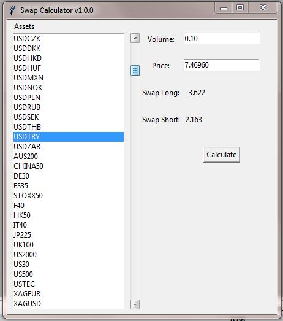

# Swap-Calculator
Calculates the amount of USD you will receive or pay for long/short positions on any asset while trading on a MetaTrader5 terminal.

## App Preview

In the above preview it shows the amount of USD you will pay or receive for taking a long
and short position on USDTRY with a volume of $10k @ 7.4696 TRY/USD

## Usage:
Launch the MT5 terminal and start the "swap calculator GUI.py" file.
A window as shown above will pop-up with a list of assets in your MT5 terminal.
Select an asset, enter volume as in MT5 order book, enter the price at which you want to make a trade and press calculate, If entry price is not entered it assumes the current asking price of the asset.
It will show you the amount of USD you will pay or receive per day for a long and short position.

## Bugs/warnings:
 - An asset should be selected (indicated by blue strip) in order for it to work.
 - MT5 terminal should have an active connection with the brokers server.

## Future updates (not guaranteed)
 - Segrigation of securities according to asset class.
 - Calculation in multiple currencies.

## For Developers:
If you want to change the calculation, so that it calculates rollover in a different currency change `pair_generator`, `fxAdjust` and `swap` functions.
